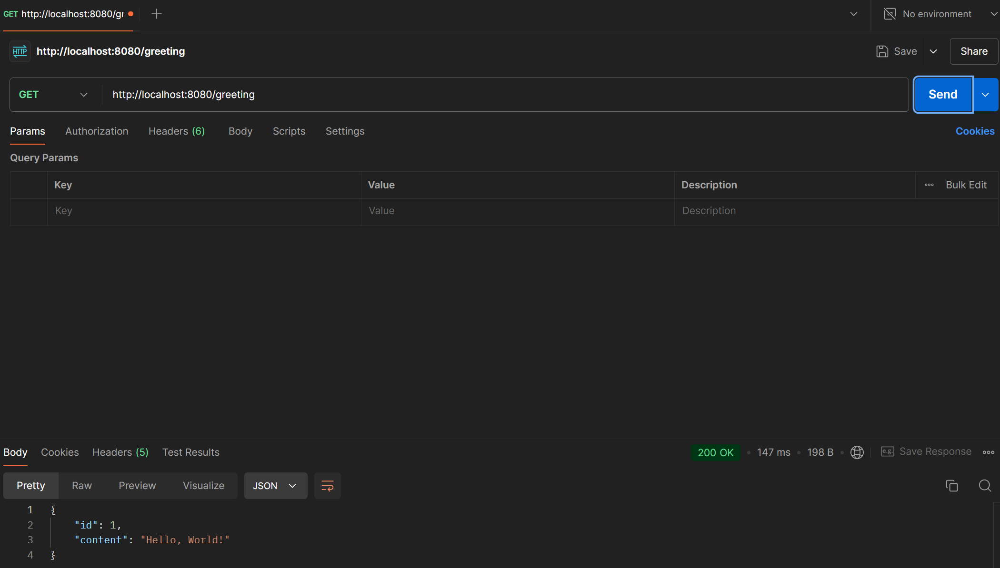

# Simple RESTful Web Service with Spring Boot
 CMPE272 - Lab1

## Short Description
A simple RESTful web service built using Spring Boot. It returns a greeting message.

## How to Run the Application
### Prerequisites
1. **Java 11 or above**
   - [Download JDK](https://www.oracle.com/java/technologies/javase-jdk11-downloads.html).
2. **Apache Maven**
   - Check Maven installation: `mvn -v`
   - [Download Maven](https://maven.apache.org/download.cgi).
3.  IDE (e.g., IntelliJ IDEA, VS Code).

### Steps to Run
1. Open the project in your IDE or terminal.
2. Build the Maven project:
    ```bash
    mvn clean install
3. Run the following command to build and run the application:
   ```bash
   mvn spring-boot:run
4. The application will start on the default port 8080.

## Test the Application
 